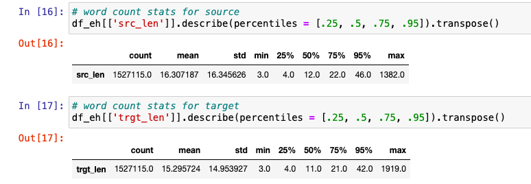
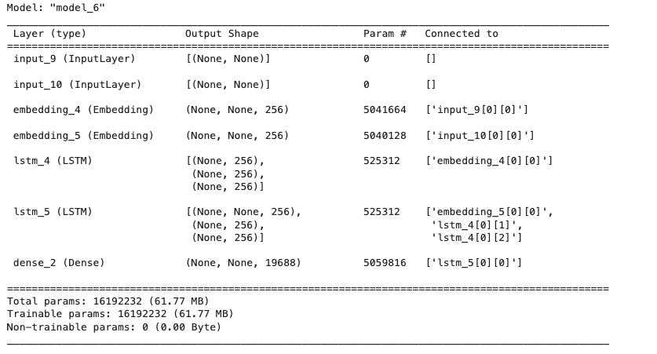
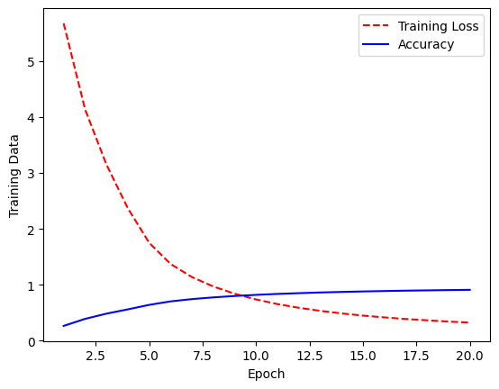
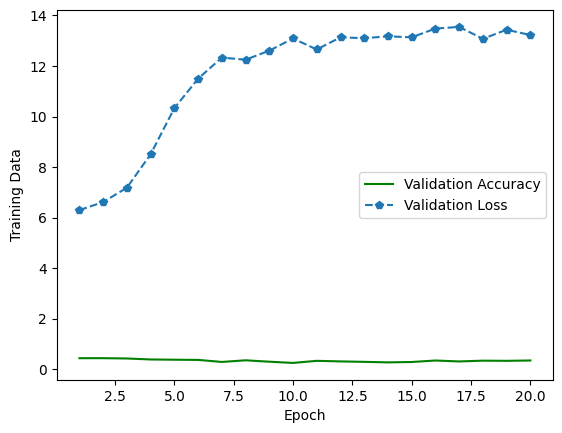
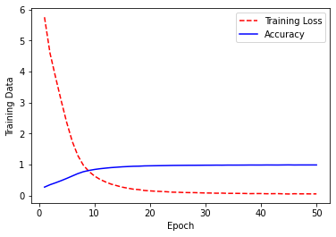
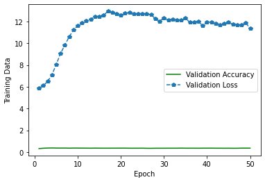

Natural language processing (NLP) has got great development with deep learning techniques. In the sub-field of machine translation, a new approach named Neural Machine Translation (NMT) has emerged and gotten massive attention from both academia and industry. Our aim with the project has been to understand the working of various machine learning algorithms (esp Neural Networks), their architectures and impacts on accuracy for translating data from one language to another. We worked with LSTM (Long Short Term Memory) and Transformers. Our focus majorly has been with LSTMs due to their short training time, while we worked around working with Transformers to understand their impact on machine translation. Per our initial analysis, we realized that Transformers in general take a lot of time to train and learn while providing better accuracy while working towards machine translation, where attention is the key. This state-of-the-art algorithm is an application of deep learning in which massive datasets of translated sentences are used to train a model capable of translating between any two languages. One of the older and more established versions of NMT is the Encoder-Decoder structure. This basically is two RNN models, one encodes the source language while the other decodes the tokens (encoded vectors) to the respective target language. When coupled with the power of attention mechanisms, this architecture can achieve impressive results as we discuss through this project.

#### What is the problem? 
The problem at hand involves developing a Neural Machine Translation (NMT) model to facilitate seamless translation between English and Hindi. The primary objective is to overcome language barriers and enhance communication across these two languages. The motivation stems from the increasing need for effective language translation tools, driven by globalization, multicultural interactions, and the desire for inclusive and accessible information exchange. With google translate dominating the translation market, we wanted to understand and implement a similar approach in order to understand the basic underlying math behind developing translation models.

#### Why is this problem interesting? Is this problem helping us solve a bigger task in some way for society? Where would we find use cases for this problem in the community?
This problem is intriguing due to its direct impact on fostering cross-cultural communication and breaking down language barriers. A successful NMT model for English-Hindi translation contributes to a more interconnected and inclusive global community. The utility extends to various domains, including business, education, healthcare, and technology, where accurate and efficient language translation is essential for effective communication and knowledge dissemination. On a larger scale, as a part of our ongoing analysis, we look towards incorporating additional languages so as to improve communication and eradicate middlewares for people to communicate.

#### What is the approach you propose to tackle the problem? What approaches make sense for this problem? Would they work well or not?
The proposed approach involves employing Long Short-Term Memory (LSTM) networks, a type of recurrent neural network (RNN), for sequence-to-sequence translation. LSTMs are well-suited for capturing sequential dependencies, making them effective in language translation tasks. The model architecture includes an encoder-decoder structure. While transformers are popular for NMT, LSTMs offer a computationally efficient alternative for certain language pairs. We have tried our hands at a pre-trained transformer model to understand and cross-validate our findings. Results are discussed in the upcoming sections.

#### What is the rationale behind the proposed approach? Did you find any reference for solving this problem previously? If there are, how does your approach differ from theirs (if any)?
The rationale for choosing LSTMs lies in their ability to capture long-range dependencies in sequential data, which is crucial for language translation. While transformer models are prevalent, especially in large-scale language models, LSTMs offer a balance between performance and computational efficiency. Previous references and research in NMT informed the choice of LSTMs, and the novelty in our approach lies in tailoring the model architecture to specifically address the nuances of English-Hindi translation.

#### What are the key components of the approach and results? Also, include any specific limitations.
Key components include embedding layers for token representation, LSTM layers for sequential learning, and encoder-decoder mechanisms for enhanced translation quality. The model will be trained on English-Hindi corpora, and results will be evaluated using the BLEU score. However, potential limitations may include the model's sensitivity to data quality, challenges in handling idiomatic expressions, and potential difficulties in rare word translation. The model might also be prone to overfitting due to the words and translations it is trained on.

### Environment Setup
The basic libraries and dependencies require to set the project up include:

	- nltk - for tokenizing and calculating bleu score
	- keras - to set and train LSTM model
	- datasets (to load datasets from Hugging Face) - To load and use dataset and pretrained model from hugging face
	- numpy, pandas, re and string for data preprocessing
	- Matplotlib - to chart and plot results
	- Tensorflow - in order to convert our raw data into tensors for tokenizing later.
	- Transformers - to load and check transformer pre-trained model(Helsinki-NLP/opus-mt-en-hi)

### Prepare datasets

#### Data Statistics:

Based on the raw data we received, we ran a basic statistical model to analyse and choose an appropriate length for each of the sentences. As per the data that we received, we chose 10 to be the average length since 50% of our data had this length. Choosing a higher length lead to very high training time, so keeping it at 10 was ideal. 

#### Preprocessing the Data
Majority of our project involved understanding, preprocessing and tokenizing our dataset. The raw dataset that we used is from Hugging face (https://huggingface.co/datasets/cfilt/iitb-english-hindi) comprising of 1.66 mn training records and 2.51K test records. 

We preprocessed the data by removing extra punctuations, stripping data, and removing foreign words from our language model. Our raw data is structured as a dictionary which we extracted into lists termed eng_sen (english sentence) and hin_sen (hindi sentence) for the ease of our reference.

Our aim was to extract sentences with length 10 understanding the complexity of data and managing the training of the dataset. We thus filtered our data upon this metric. Post this we added the <START> and <END> token to each of the sentence of the target language. If the sentence length after adding these tokens was lesser than 10, we added padding at the end of each of these sentences.

#### Creating the Vocabulary

To create a comprehensive vocabulary from our filtered dataset, we utilize Keras' Tokenizer library. This tool breaks down the text into tokens and assigns unique numerical identifiers to each token, forming the vocabulary. Following vocabulary creation, we proceed to tokenizing them.

In the process of preparing inputs for the encoder, we apply padding at the end of each sentence, denoted by padding='post'. This choice of padding is particularly significant for neural network architectures, such as recurrent neural networks (RNNs) or transformers, where inputs must have a consistent length.

Padding plays a crucial role in ensuring uniform input lengths, facilitating the construction of batches for efficient training. It is essential for creating a structured neural network that handles inputs consistently. The structured architecture becomes particularly relevant for models with a decoder, as it enables the network to provide even inputs and receive corresponding outputs.

In summary, by incorporating padding at the end of sentences, we not only establish a consistent input structure but also contribute to the efficient training and convergence of the neural network, especially in architectures involving a decoder.

Finally after preprocessing is complete we split our dataset into training and test with 95% of the preprocessed data being used for training while 5% is used for testing and calculating BLEU score.

### Creating the model
We designed a Long Short-Term Memory (LSTM) model for sequence-to-sequence translation tasks, focusing on language translation from English to Hindi. The model architecture comprises of an encoder-decoder structure, a widely used technique for handling sequential data.

The encoder processes the input sequences (English sentences) and extracts meaningful representations. Key components of the encoder include:
- Embedding Layer: This layer converts the input tokens into dense vectors, facilitating the neural network's understanding of word relationships.
- LSTM Layer: Utilizing Long Short-Term Memory cells, the encoder captures contextual information from the input sequences. The LSTM layer returns the final hidden memory state and the carry state for subsequent use in the decoder.

The decoder generates the target sequences (Hindi translations) based on the encoded information. Notable elements of the decoder include:
- Embedding Layer: Similar to the encoder, this layer transforms the target tokens into dense vectors.
- LSTM Layer: The decoder LSTM processes the embedded target sequences while considering the context provided by the encoder. It returns sequences of outputs and the final states.

A Dense layer with a softmax activation function is added to produce probability distributions over the Hindi vocabulary. This allows the model to predict the most likely Hindi token for each position in the output sequence.

The model is compiled using the Adam optimizer and Sparse Categorical Cross Entropy as the loss function. The choice of the optimizer and loss function is motivated by their effectiveness in sequence-to-sequence tasks. The model is configured to optimize for accuracy during training.

### Training the model
Below describes our model’s training and validation sets accuracy vs loss curves over 20 epochs for model with 250k data records:

For model with 50k records and 50 epochs, below were our results:

We observe that we receive an accuracy of around 91% while the epoch loss also considerably reduces using LSTMs.
	
The notebook also has experimental results of training and validation accuracy vs loss for 20, and 50 epochs respectively with varying amounts of training set size for us to analyze and conclude the BLEU scores.

#### Steps to run
	- Since the saved models are over 100 MB, GitHub is not allowing us to directly upload these models. Extract the folders (respectve models) from given link:
 	- https://drive.google.com/file/d/1mKVcVLIhvDDMuOIyEyfvmtLxpKb0zL8z/view
 	- Please make sure that both the saved model folders are in the same directory as the respective notebooks in order to load them
	- Load the preprocessed data
	- Load the model for LSTM 
	- Set up encoder and decoders for testing the model
	- Predict texts
	- Calculate and print BLEU scores in order to verify accuracy

#### Model Comparison and Analysis LSTM vs Pretrained Transformer
To benchmark the performance of our LSTM-based sequence-to-sequence model, we conducted a comparative analysis with a pretrained Transformer model (Helsinki-NLP/opus-mt-en-hi) obtained from Hugging Face, specifically trained on the Opus dataset. Given the nature of the Transformer architecture, which excels in capturing long-range dependencies through attention mechanisms, we anticipated superior results.

The BLEU (Bilingual Evaluation Understudy) score is a metric commonly used to evaluate the quality of machine-generated translations in Natural Language Processing (NLP), particularly in the context of Neural Machine Translation (NMT). BLEU was designed to align with human intuition about translation quality and has become a standard metric for comparing the performance of different translation models. It evaluates the precision of the generated translation by comparing it to one or more reference translations. It considers n-grams (contiguous sequences of n items, typically words) in the generated translation and checks how many of these n-grams are also present in the reference translation.

Surprisingly, our findings indicate that the LSTM model performed remarkably well in comparison, demonstrating similar levels of accuracy and achieving competitive BLEU scores. Despite the architectural differences, the LSTM model proved to be robust in capturing contextual information and generating coherent translations. This suggests that for certain language translation tasks, the inherent capacity of LSTMs to capture sequential dependencies might be on par with the attention mechanisms employed by Transformers.

The pretrained Transformer model, while undoubtedly powerful and capable of capturing intricate details, did not exhibit a substantial performance advantage in our specific task. This observation underscores the importance of task-specific evaluations and the nuanced nature of model comparisons. Our results encourage further exploration into the effectiveness of traditional recurrent architectures like LSTMs, particularly in scenarios where pretrained models might not necessarily outperform their sequential counterparts.

### Conclusion
This LSTM-based sequence-to-sequence model serves as a powerful tool for English-to-Hindi language translation. The detailed architecture, training configuration, and evaluation metrics establish a foundation for further experimentation and improvements. Results below indicate the outperformance of Transformers, the reason for its recent hype and the future of machine translation with Transformers.

BLEU score for Transformers (Baseline): 0.13276982988333147

|   Epochs   |   Train size|   BLEU Score   |
|------------|-------------|----------------|
|   50	|   50k records	   |   0.5204079142754721   |
|   20	|   250k records   |   0.5446195830945151   |

### Future Work
Our aim with this project is to take this further, training bidirectionally for hindi and english. We look towards improving our accuracy, working with transformers and achieving a consistent state in order to work with more data. We also look towards expanding this project to include a third language where the model understands the introduction of the third language and is able to translate from hindi to the third language using english as the middleware decoder. In order to achieve this, we are building confidence on translating from hindi to english with an accuracy of 95% or higher.

### References
- https://medium.com/geekculture/english-to-hindi-text-translation-using-marianmt-models-from-huggingface-187b4719809e
- https://towardsdatascience.com/neural-machine-translation-15ecf6b0b
- https://huggingface.co/datasets/cfilt/iitb-english-hindi
- https://huggingface.co/damerajee/hindi-english
- https://www.tensorflow.org/api_docs/python/tf/keras/preprocessing/text/Tokenizer
- https://www.tensorflow.org/api_docs/python/tf/keras/utils/pad_sequences
- https://www.tensorflow.org/api_docs/python/tf/keras/losses/SparseCategoricalCrossentropy
- https://keras.io/api/layers/core_layers/dense/
- https://www.nltk.org/api/nltk.translate.bleu_score.html
